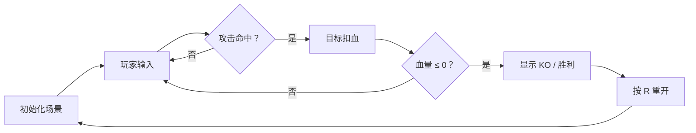

# 像素风机甲对战小游戏 — 产品需求文档

## 1. 产品概述

一款复古像素风格的双人机甲对战小游戏，玩家可在本地与好友同屏竞技。
通过简洁的键盘操控实现移动、攻击、防御与血量博弈，快速上手并体验像素机甲战斗的爽快感。

- **主要目的**：提供一个无需网络、即开即玩的轻量对战 Demo。
- **目标用户**：喜爱像素风、复古街机与机甲题材的玩家。
- **产品价值**：作为可运行的原型展示核心战斗循环与美术方向。

## 2. 核心功能

### 2.1 用户角色

| 角色 | 控制方式 | 核心权限 |
|------|----------|----------|
| 玩家 1（蓝方机甲） | 键盘 WASD + J（攻击）+ K（防御） | 操控左侧机甲 |
| 玩家 2（红方机甲） | 键盘 方向键 + 1（攻击）+ 2（防御） | 操控右侧机甲 |

### 2.2 功能模块

1. **游戏主画面**：像素场景、两台机甲、血条与胜负提示。
2. **战斗系统**：移动、普通攻击、防御、受击、血量扣减与胜负判定。
3. **动画系统**：待机、移动、攻击、防御、受击、死亡等像素帧动画。
4. **状态提示**：回合开始、KO 提示、重置对局。

### 2.3 页面/模块详情

| 页面/模块 | 子模块 | 功能描述 |
|-----------|--------|----------|
| 游戏主画面 | 像素场景 | 星空/网格地面，营造复古机甲战场氛围 |
| 游戏主画面 | 机甲角色 | 蓝/红两台像素机甲，带待机与动作帧动画 |
| 游戏主画面 | HUD 血条 | 顶部显示双方血量与颜色标识 |
| 游戏主画面 | 胜负提示 | 一方血量归零后显示 KO 与重开提示 |
| 控制系统 | 键盘输入 | 双玩家独立键位，支持同时输入 |

## 3. 核心流程

对战流程：双方进入场景 → 自由移动与攻防 → 命中对方扣血 → 一方血量归零 → 显示胜负 → 按 R 重开。

## 4. 用户界面设计

### 4.1 设计风格

- **主色调**：深空灰/靛蓝背景（#1a1c2c）+ 高饱和机甲蓝（#29adff）与熔岩红（#ff0044）。
- **按钮/控件**：无物理按钮，操作全部通过键盘；UI 以像素边框和块状色块呈现。
- **字体**：使用系统默认等宽或像素风格字体（`Courier New`, `Press Start 2P` 备选），字号 12–16px。
- **布局**：全屏 Canvas 居中，顶部 HUD 悬浮显示，底部显示操作说明。
- **图标/动画**：全部使用 Canvas 绘制像素块与逐帧动画，无需外部图片素材。

### 4.2 页面设计概述

| 页面/模块 | 子模块 | UI 元素 |
|-----------|--------|---------|
| 游戏主画面 | 场景 | 星空背景、地面网格、远处建筑剪影 |
| 游戏主画面 | 机甲 | 蓝/红色块机甲，8×8~16×16 像素部件，带呼吸待机动画 |
| 游戏主画面 | HUD | 顶部左右血条、中间回合标识 |
| 游戏主画面 | 提示层 | 大字号 KO / WINNER / Press R to restart |

### 4.3 响应式与性能

- **桌面优先**：默认 960×540 逻辑分辨率，Canvas 按窗口等比缩放。
- **性能目标**：60fps，输入延迟 < 16ms；动画与物理使用 requestAnimationFrame 驱动。
- **触控**：本期暂不支持触控，仅键盘操作。

### 4.4 动画与特效指导

- **待机**：机甲上下轻微浮动，天线/武器小幅摆动。
- **移动**：履带/腿部循环滚动，机身随步伐轻微倾斜。
- **攻击**：挥动光剑/拳套前冲，命中时产生白色像素火花。
- **防御**：举起护盾，机身变暗并出现蓝色/红色屏障光晕。
- **受击**：机身闪烁红色，向后击退。
- **死亡**：机甲爆炸成粒子碎片，屏幕微震。
