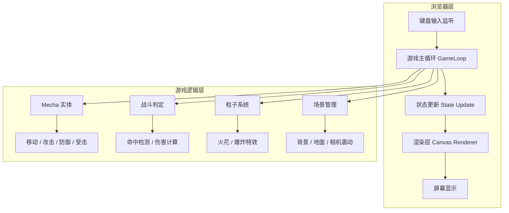

# 像素风机甲对战小游戏 — 技术架构文档

## 1. 架构设计



## 2. 技术描述

- **前端**：HTML5 Canvas + 原生 JavaScript（ES Modules），无框架依赖。
- **构建工具**：Vite（提供本地开发与热更新）。
- **后端**：无。
- **数据库**：无，游戏状态全部保存在内存中。
- **素材方案**：纯代码绘制像素图形，无需外部图片资源；字体使用 Google Fonts `Press Start 2P` 作为可选加载。

## 3. 路由定义

| 路由 | 用途 |
|------|------|
| `/` | 游戏主页面，包含 Canvas、HUD 与操作说明 |

## 4. 核心数据结构

```javascript
// 游戏状态
const gameState = {
  status: 'playing' | 'ko' | 'restart',
  winner: null | 'p1' | 'p2',
  cameraShake: 0,
};

// 机甲实体
const mecha = {
  id: 'p1' | 'p2',
  x, y, vx, vy,
  width, height,
  hp, maxHp,
  facing: 1 | -1,
  state: 'idle' | 'move' | 'attack' | 'guard' | 'hit' | 'dead',
  stateTimer: 0,
  color: string,
  keys: { left, right, up, attack, guard },
};

// 粒子
const particle = {
  x, y, vx, vy, life, color, size,
};
```

## 5. 模块职责

| 文件 | 职责 |
|------|------|
| `index.html` | 页面结构与字体引入 |
| `src/main.js` | 初始化、事件绑定、游戏循环入口 |
| `src/game.js` | 游戏状态机、碰撞判定、胜负逻辑 |
| `src/mecha.js` | 机甲类：输入处理、状态机、动画帧 |
| `src/renderer.js` | Canvas 绘制：场景、机甲、HUD、特效 |
| `src/particles.js` | 粒子系统：火花、爆炸、烟雾 |
| `src/style.css` | 全屏布局、像素字体、HUD 样式 |

## 6. 输入映射

| 玩家 | 左移 | 右移 | 跳跃 | 攻击 | 防御 | 重开 |
|------|------|------|------|------|------|------|
| P1 蓝方 | A | D | W | J | K | R |
| P2 红方 | ← | → | ↑ | 数字 1 | 数字 2 | R |

## 7. 运行与构建

```bash
# 开发
npm install
npm run dev

# 构建
npm run build
```

默认开发服务器端口 `5173`，构建产物输出至 `dist/`。
